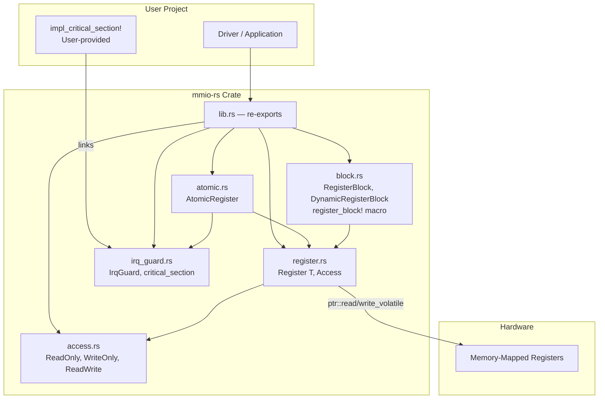
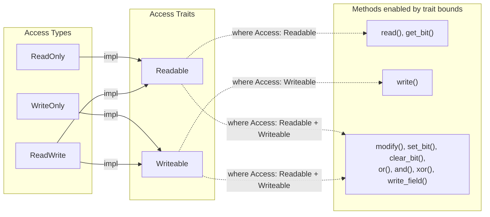
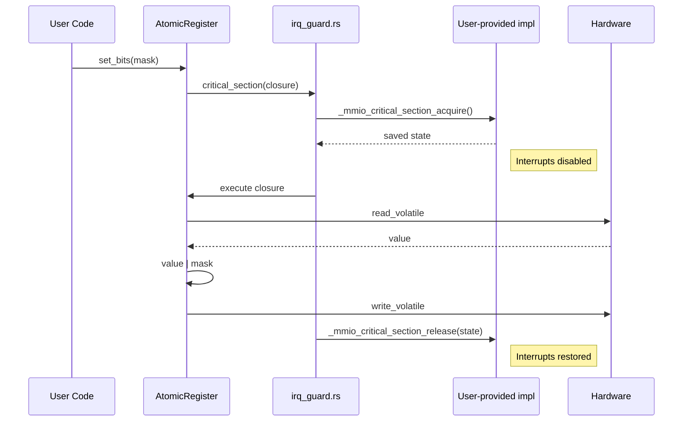
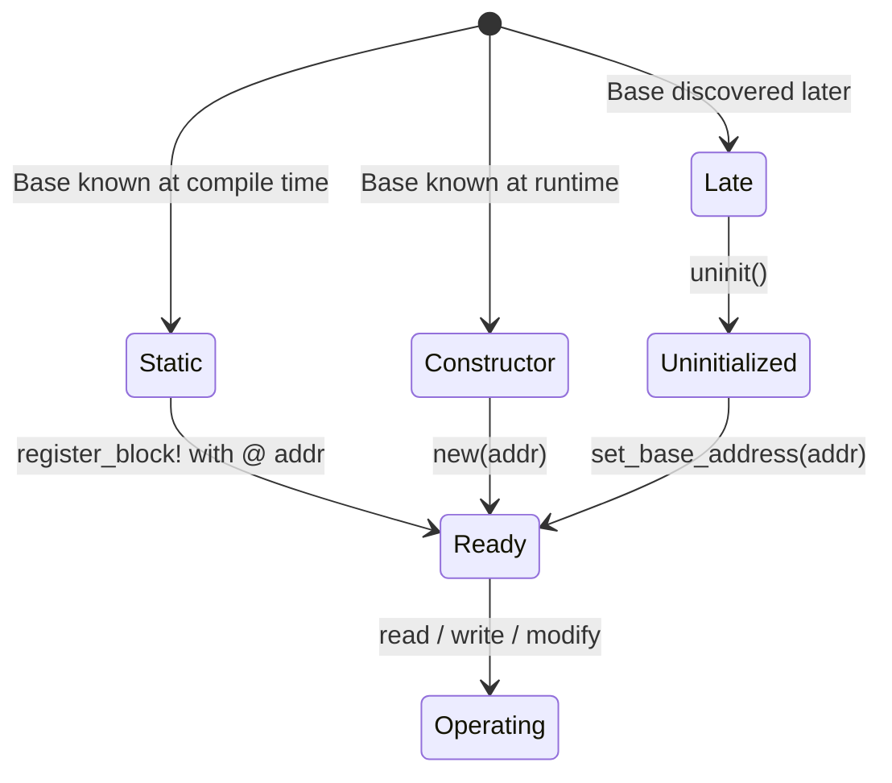
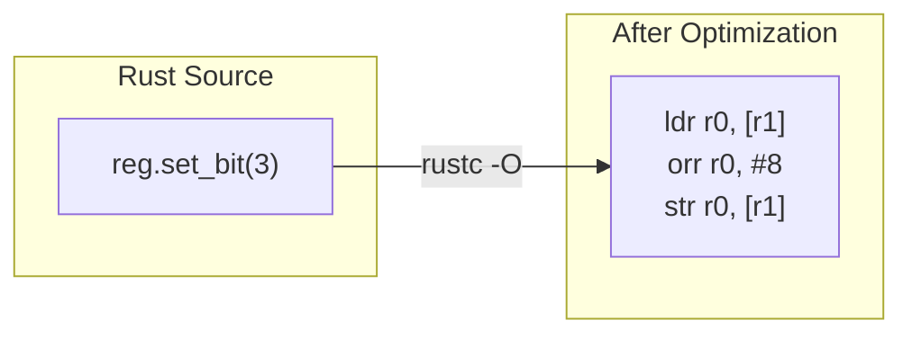

# Architecture

## Overview

`mmio-rs` is a zero-overhead, `no_std`, zero-dependency Rust crate for type-safe access to memory-mapped hardware registers. It compiles to the same instructions as raw volatile pointer access, with compile-time safety guarantees.

## Module Structure

## Type System Enforcement

Attempting to call `write()` on a `Register<u32, ReadOnly>` produces a compile error — no runtime cost.

## Critical Section Architecture

The library declares `extern "Rust"` functions. The user links them via `impl_critical_section!`. This keeps the crate architecture-agnostic — it works on ARM, RISC-V, Xtensa, or even host tests.

## Register Block Initialization Modes

## Zero-Cost Guarantee

Every register operation compiles to a single volatile load or store instruction. The type system exists only at compile time:

No vtables, no heap, no indirection, no branches for access checks.

## Design Decisions

| Decision | Rationale |
|----------|-----------|
| `extern "Rust"` for critical section | Zero deps, user configures per-platform, linker error if missing |
| Trait bounds for access | Compile-time enforcement, zero runtime cost |
| `#[inline(always)]` everywhere | Ensures optimizer sees through all abstractions |
| `*mut T` pointer internally | Allows null state for two-phase init |
| `register_block!` macro | Named fields ergonomics without proc-macro dependency |
| `no_std` only | Embedded-first, works everywhere including hosted |
| `Send + Sync` on Register | Registers are memory addresses, safe to share references |
